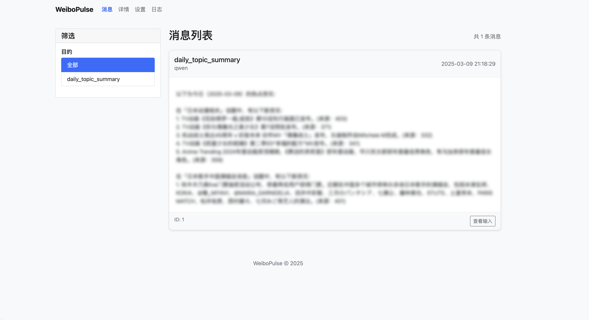
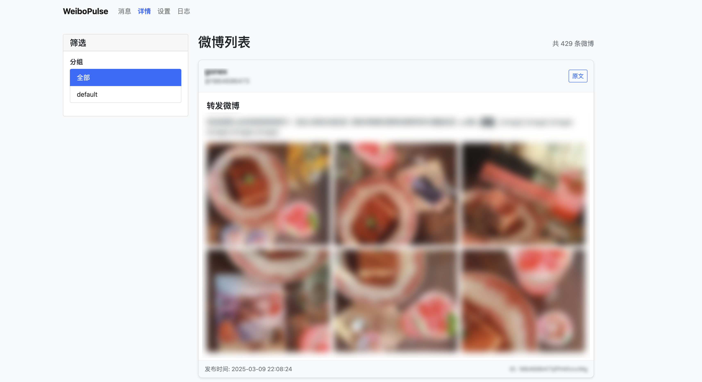
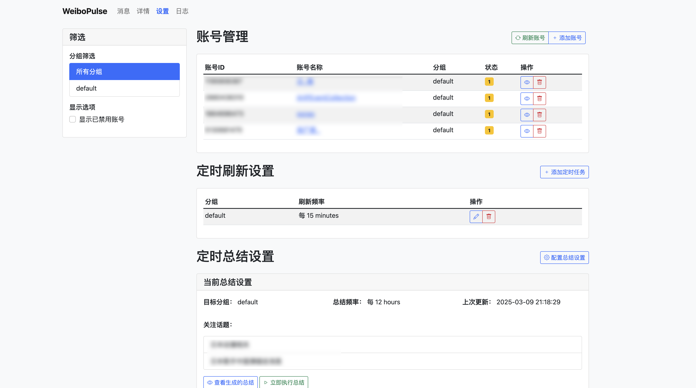

# WeiboPulse

这是一个可以在个人NAS上布置的微博RSS订阅和展示系统。支持定时抓取微博内容、内容展示和AI自定义话题总结。

## 功能特点

- **RSS订阅**：通过RSS源订阅微博账号内容
- **定时抓取**：自动定时抓取和更新微博内容
- **媒体下载**：自动下载和存储微博中的图片
- **AI总结**：基于阿里百炼调用大模型对微博内容进行自定义话题总结
- **Web界面**：提供美观的Web界面展示微博内容和话题总结
- **账号分组**：支持微博账号分组和管理
- **内容检索**：支持按时间、账号、关键词等检索微博内容

## 截图展示

<table>
  <tr>
    <td align="center"><br/>总结消息页</td>
    <td align="center"><br/>微博详情页</td>
    <td align="center"><br/>设置页</td>
  </tr>
</table>

## 快速开始

### 前提条件

- Docker 和 Docker Compose 已安装
- 阿里百炼API密钥（可选，用于AI总结功能）
- 微博RSS源（推荐使用 [weibo-rss](https://github.com/zgq354/weibo-rss)）

### 安装步骤

1. **配置环境变量**

   从示例文件创建配置文件：

   ```bash
   cp .env.example .env
   cp docker-compose.example.yml docker-compose.yml
   ```

   然后编辑 `.env` 和 `docker-compose.yml` 文件，根据您的环境进行配置。

2. **启动服务**

   你可以选择使用python启动服务：

   ```bash 
   pip install -r requirements.txt
   cd src 
   python web.py
   ```

   或者使用docker-compose启动：

   ```bash
   docker-compose up -d
   ```

3. **访问Web界面**

   服务启动后，通过浏览器访问：

   ```
   http://your-host-ip:8000
   ```

## 配置说明

### 环境变量

以下是主要的环境变量及其说明：

| 变量名 | 说明 | 
|--------|------|
| RSS_BASE_URL | RSS源地址 | 
| WEB_HOST | Web服务监听地址 | 
| WEB_PORT | Web服务监听端口 |
| TZ | 时区设置 |
| ALIYUN_API_KEY | 阿里百炼API密钥 | 
| TEXT_MODEL | 纯文本模型 | 
| MULTIMODAL_MODEL | 多模态模型 | 
| DATA_DIR | 数据目录 |


## TODO

* 目前只实现了调用纯文本模型，并没有实现多模态模型的调用

* 只能下载图片，不能下载视频

